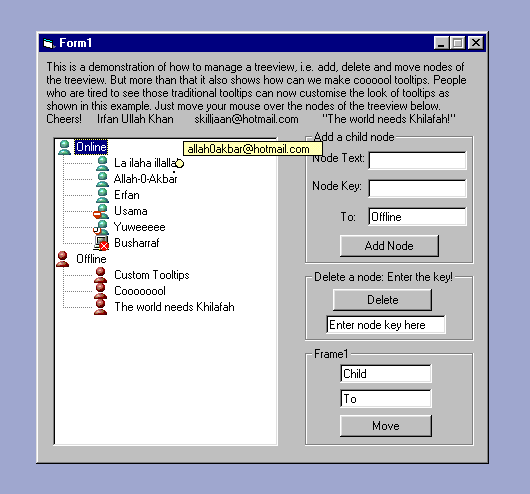



## Animated Customised Tool tips \+ Treeview Management \(Add, remove and move nodes\)\!

### Description

It shows the basics of treeview management as well as how to create animated customised tooltips. It shows how to add and remove nodes, how to set their icons, how to move nodes. More than this it shows how to create some cool and awesome tooltips.
 
### More Info
 
None!

             |
---                |---
**Submitted On**   |2003-05-01 15:43:32
**By**             |[Irfan Ullah Khan](https://github.com/Planet-Source-Code/PSCIndex/blob/master/ByAuthor/irfan-ullah-khan.md)
**Level**          |Beginner
**User Rating**    |4.8 (24 globes from 5 users)
**Compatibility**  |VB 4\.0 \(32\-bit\), VB 5\.0, VB 6\.0
**Category**       |[Custom Controls/ Forms/  Menus](https://github.com/Planet-Source-Code/PSCIndex/blob/master/ByCategory/custom-controls-forms-menus__1-4.md)
**World**          |[Visual Basic](https://github.com/Planet-Source-Code/PSCIndex/blob/master/ByWorld/visual-basic.md)
**Archive File**   |[Animated\_C158474572003\.zip](https://github.com/Planet-Source-Code/irfan-ullah-khan-animated-customised-tool-tips-treeview-management-add-remove-and-move-nod__1-45318/archive/master.zip)

